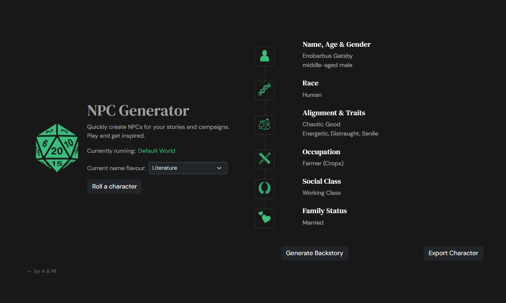

# NPC Generator

This app generates random minor characters for tabletop rpgs.\
It can be configured to respect custom settings for an rpg world, i.e. considering the likelihood of certain races, social classes, occupations, etc.\
Additionally, you can choose a name "flavour" (via the [Behind the Name API](https://www.behindthename.com/api/) ), generate a backstory (via [openai](https://www.npmjs.com/package/openai)) and export your character.\
\
This app was built with the use case in mind to quickly generate rich minor characters mid-session or on the fly.\
Try it [here](https://dnd-npc-generator-ffc22106c853.herokuapp.com/)



## Run it locally

* Copy this repo
* add a .env file at root and replace the api key placeholder with your keys
```sh
VITE_OPENAI_API_KEY = aimlapi_key
VITE_OPENAI_BASE_URL = https://api.aimlapi.com/v1/
VITE_OPENAI_MODEL_ID = gpt-4o-mini-2024-07-18
VITE_NAMESDB_API_KEY = behind_the_name_api_key
VITE_NAMESDB_BASE_URL = https://www.behindthename.com/api/
```

* run `npm install` (to install dependencies)
* run `npm dev` (build and hotload for development), or
* run `npm start` (to build and run)
    * open the app at `http://localhost:5000/`

## Customize configuration

* Edit the file at `./src/assets/data/world.json`
